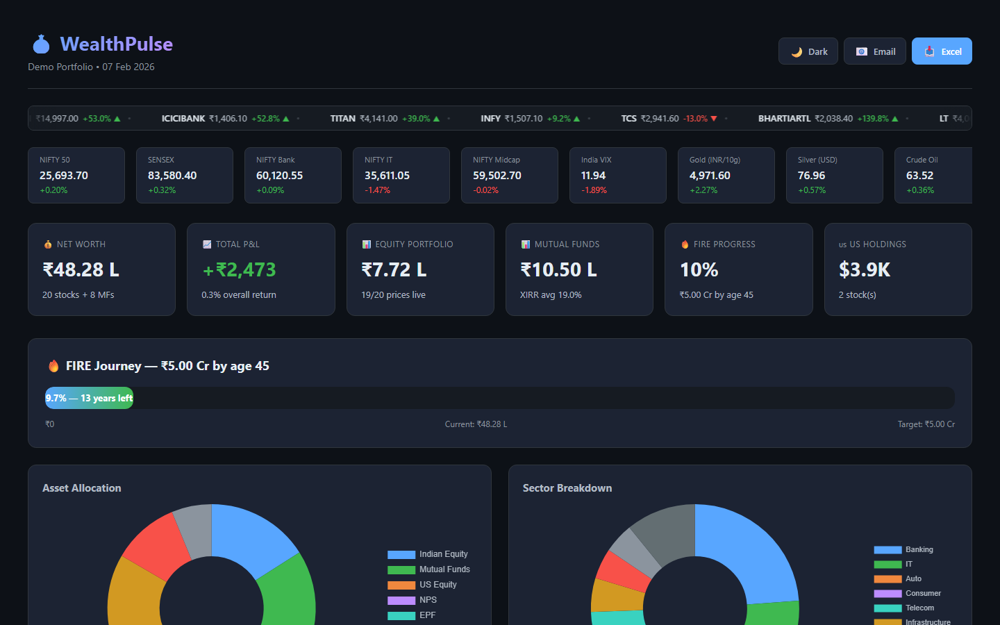
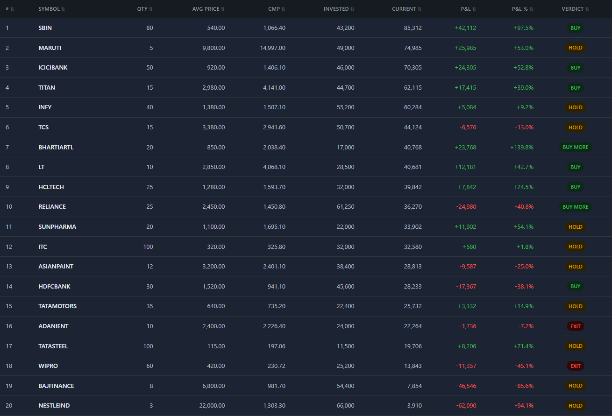
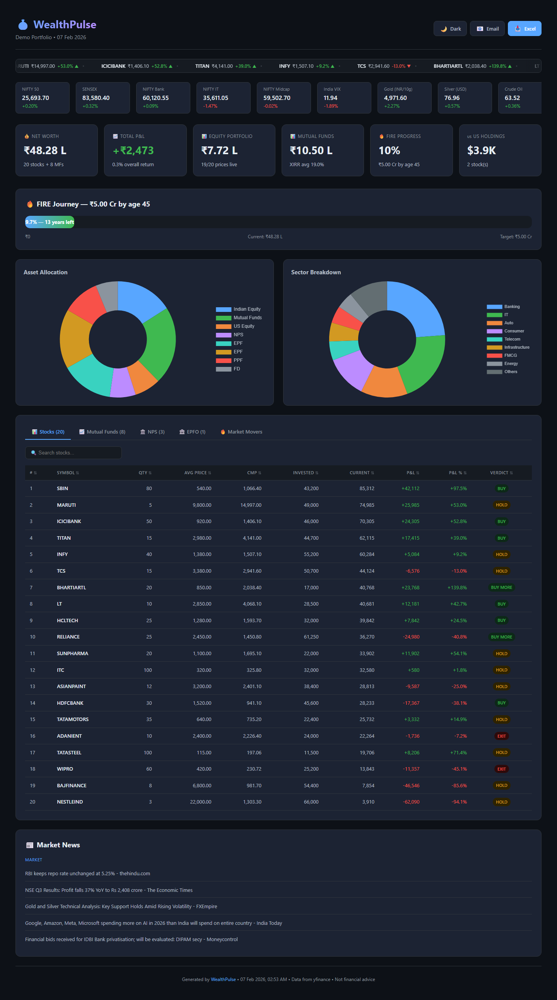

# 💰 WealthPulse

**Your open-source, self-hosted portfolio dashboard for Indian & US markets.**

[](https://www.python.org/downloads/)
[](LICENSE)
[](CONTRIBUTING.md)

WealthPulse turns your broker statement exports into a beautiful, interactive HTML dashboard — no cloud, no subscriptions, **your data stays on your machine**.

---

## 📸 Screenshots

### Dashboard — Dark Mode

<p align="center">
  
</p>

> Scrolling stock marquee • Live index strip • KPI cards • FIRE progress bar • Chart.js pie charts

### Dashboard — Light Mode

<p align="center">
  
</p>

> One-click theme toggle — switch between dark and light themes

### Stock Marquee Ticker

<p align="center">
  
</p>

> Real-time scrolling marquee with your portfolio stocks, prices, and P&L arrows

### Holdings Table

<p align="center">
  
</p>

> Tabbed views: Stocks • Mutual Funds • NPS • EPFO • Top Movers — with verdict badges

### Daily Email Brief

<p align="center">
  
</p>

> Automated morning/evening portfolio summary delivered to your inbox — dark-mode email with indices, movers, MF summary & headlines

### CLI

<p align="center">
  
</p>

> Rich CLI with `wealthpulse demo` — try it in 30 seconds, no setup needed

<details>
<summary>🖼️ Full Dashboard Screenshots (click to expand)</summary>

#### Full Dashboard — Dark Mode


#### Full Dashboard — Light Mode


</details>

---

## ✨ Features

| Feature | Description |
|---|---|
| 📊 **Interactive Dashboard** | Beautiful dark/light theme HTML report with Chart.js charts |
| 📧 **Daily Email Brief** | Automated morning/evening portfolio summary to your inbox |
| 🔌 **Multi-Broker Support** | Groww, Zerodha, Angel One, Upstox, ICICI Direct, HDFC Securities, Kotak, Dhan, 5paisa, MF CAS, Fidelity, Morgan Stanley |
| 🏛️ **NPS & EPFO Tracking** | Parse NPS statements and EPFO passbooks for holistic net worth |
| 🔥 **FIRE Tracker** | Track progress toward your Financial Independence goal |
| 📈 **Live Market Data** | Real-time prices via yfinance (NIFTY, SENSEX, Gold, Silver, USD) |
| 📰 **Market News** | Google News RSS feeds integrated into dashboard |
| 🎯 **Stock Verdicts** | Tag each stock as BUY / HOLD / EXIT with color-coded badges |
| 🇺🇸 **US Holdings** | Track Fidelity & Morgan Stanley international portfolios |
| 🔒 **100% Private** | Self-hosted, no data leaves your machine, ever |
| 🧩 **Plugin Parsers** | Easy to add your own broker parser (see guide below) |

---

## 🚀 Quick Start

### 1. Install

```bash
pip install -e .
```

Or with requirements:

```bash
pip install -r requirements.txt
pip install -e .
```

### 2. Try the Demo

```bash
wealthpulse demo
```

This generates a dashboard with sample data — no setup needed! Opens right in your browser.

### 3. Set Up Your Portfolio

```bash
wealthpulse setup
```

The interactive wizard walks you through:
- Creating your config file
- Choosing your brokers
- Setting FIRE goals
- Configuring email notifications

### 4. Parse & Generate

```bash
# Drop your statement files into data/statements/
# Then:
wealthpulse parse        # Parse statements → portfolio JSON
wealthpulse dashboard    # Generate beautiful HTML dashboard
```

### 5. Daily Email Brief (Optional)

```bash
wealthpulse email        # Send one-time
wealthpulse schedule     # Set up daily scheduling (Win/Mac/Linux)
```

---

## 📁 Project Structure

```
WealthPulse/
├── config/
│   ├── config.example.yaml     # Template — copy to config.yaml
│   └── config.yaml             # Your config (git-ignored)
├── data/
│   ├── statements/             # Drop broker exports here
│   └── portfolio_data.json     # Generated portfolio (git-ignored)
├── output/                     # Generated dashboards
├── src/wealthpulse/
│   ├── cli.py                  # CLI entry point
│   ├── parsers/                # Broker-specific parsers
│   │   ├── base.py             # BaseParser ABC + dataclasses
│   │   ├── groww.py            # Groww Excel parser
│   │   ├── zerodha.py          # Zerodha/Kite Excel parser
│   │   ├── angel_one.py        # Angel One CSV/Excel parser
│   │   ├── upstox.py           # Upstox CSV/Excel parser
│   │   ├── icici_direct.py     # ICICI Direct CSV/Excel parser
│   │   ├── hdfc_securities.py  # HDFC Securities CSV/Excel parser
│   │   ├── kotak.py            # Kotak Securities CSV/Excel parser
│   │   ├── dhan.py             # Dhan CSV/Excel parser
│   │   ├── five_paisa.py       # 5paisa CSV/Excel parser
│   │   ├── mutual_funds.py     # MF CAS Excel parser
│   │   ├── fidelity.py         # Fidelity PDF parser
│   │   ├── morgan_stanley.py   # Morgan Stanley PDF parser
│   │   ├── nps.py              # NPS statement PDF parser
│   │   └── epfo.py             # EPFO passbook PDF/CSV/Excel parser
│   ├── core/
│   │   ├── config.py           # YAML config loader
│   │   ├── portfolio.py        # Portfolio consolidation engine
│   │   ├── market_data.py      # Live prices, movers, indices
│   │   ├── dashboard.py        # HTML dashboard generator
│   │   └── email_sender.py     # SMTP email sender
│   ├── templates/
│   │   ├── dashboard.html      # Jinja2 dashboard template
│   │   └── email_brief.html    # Jinja2 email template
│   └── samples/
│       └── sample_portfolio.json
├── pyproject.toml
├── requirements.txt
└── README.md
```

---

## 📊 Supported Brokers & File Formats

### Indian Equity Brokers

| Broker | Format | File Pattern | What It Extracts |
|---|---|---|---|
| **Groww** | Excel | `Groww_*.xlsx` | Stocks, qty, avg price, ISIN, invested value |
| **Zerodha** | Excel | `Zerodha_*.xlsx` | Stocks, qty, avg price, P&L, closing price |
| **Angel One** | CSV/Excel | `AngelOne_*.xlsx/csv` | Stocks, qty, avg price, market price |
| **Upstox** | CSV/Excel | `Upstox_*.xlsx/csv` | Stocks, qty, avg price, current value |
| **ICICI Direct** | CSV/Excel | `ICICIDirect_*.xlsx/csv` | Stocks, qty, avg price, market value |
| **HDFC Securities** | CSV/Excel | `HDFC_Securities_*.xlsx/csv` | Stocks, qty, avg price, LTP |
| **Kotak Securities** | CSV/Excel | `Kotak_*.xlsx/csv` | Stocks, qty, avg price, market price |
| **Dhan** | CSV/Excel | `Dhan_*.xlsx/csv` | Stocks, qty, avg price, current value |
| **5paisa** | CSV/Excel | `5paisa_*.xlsx/csv` | Stocks, qty, avg price, market value |

### Mutual Funds & US Holdings

| Source | Format | File Pattern | What It Extracts |
|---|---|---|---|
| **MF Central** | Excel | `MutualFunds_*.xlsx` | Fund name, category, XIRR, invested/current, folios |
| **Fidelity** | PDF | `Fidelity_*.pdf` | US stocks, shares, price, total value |
| **Morgan Stanley** | PDF | `MorganStanley_*.pdf` | ESOP/RSU shares, price, value |

### Retirement Accounts (NPS & EPFO)

| Source | Format | File Pattern | What It Extracts |
|---|---|---|---|
| **NPS (CRA)** | PDF | `NPS_*.pdf` | PRAN, fund manager, asset class, NAV, units, corpus |
| **EPFO** | PDF/CSV/Excel | `EPFO_*.pdf/xlsx/csv` | UAN, EE/ER/pension shares, total balance, interest |

### Getting Your Statements

**Equity Brokers:**
1. **Groww**: Login → Portfolio → Download Holdings (Excel)
2. **Zerodha**: Console → Holdings → Download
3. **Angel One**: Login → Portfolio → Holdings → Download CSV
4. **Upstox**: Login → Portfolio → Holdings → Export
5. **ICICI Direct**: Login → Portfolio → Equity → Download
6. **HDFC Securities**: Login → Portfolio → Download Holdings
7. **Kotak Securities**: Login → Portfolio → Export
8. **Dhan**: Login → Holdings → Download
9. **5paisa**: Login → Portfolio → Export Holdings

**Mutual Funds:**
10. **MF Central**: mfcentral.com → CAS Statement → Detailed (Excel)

**US Holdings:**
11. **Fidelity**: NetBenefits → Portfolio → Download PDF
12. **Morgan Stanley**: StockPlan Connect → Holdings → Download

**Retirement Accounts:**
13. **NPS**: npscra.nsdl.co.in → Login → Transaction Statement → Download PDF
14. **EPFO**: passbook.epfindia.gov.in → Login → Download Passbook (PDF)

---

## ⚙️ Configuration

Copy the example config and customize:

```bash
cp config/config.example.yaml config/config.yaml
```

### Key Config Sections

```yaml
profile:
  name: "John Doe"           # Shown on dashboard header

fire:
  target_corpus: 50000000    # ₹5 Cr target
  target_age: 45
  current_age: 30
  monthly_sip: 100000
  expected_return: 12.0

brokers:
  groww:
    enabled: true
  zerodha:
    enabled: true
  mutual_funds:
    enabled: true

verdicts:                     # Your stock-by-stock calls
  RELIANCE: BUY MORE
  TCS: HOLD
  WIPRO: EXIT

non_equity:                   # Fixed assets (for net worth)
  EPF: 800000
  PPF: 500000
  FD: 300000
  NPS: 200000

email:
  enabled: true
  sender: your.email@gmail.com
  app_password: xxxx xxxx xxxx xxxx   # Gmail App Password
  recipients:
    - your.email@gmail.com

dashboard:
  theme: dark                 # dark or light
```

---

## 🧩 Adding a Custom Parser

WealthPulse uses a plugin architecture. To add support for a new broker:

### 1. Create a parser file

```python
# src/wealthpulse/parsers/my_broker.py
from wealthpulse.parsers.base import BaseParser, ParseResult, StockHolding

class MyBrokerParser(BaseParser):
    """Parser for MyBroker statement exports."""

    broker_name = "MyBroker"
    file_patterns = ["MyBroker_*.xlsx", "mybroker_*.csv"]

    def parse(self, file_path: str) -> ParseResult:
        stocks = []
        # Your parsing logic here...
        stocks.append(StockHolding(
            symbol="RELIANCE",
            isin="INE002A01018",
            qty=10,
            avg_price=2500.00,
            invested=25000.00,
            broker="MyBroker",
        ))
        return ParseResult(stocks=stocks, broker_name="MyBroker")
```

### 2. Register in portfolio.py

```python
# In src/wealthpulse/core/portfolio.py
from wealthpulse.parsers.my_broker import MyBrokerParser

PARSER_REGISTRY = {
    ...
    "my_broker": MyBrokerParser,
}
```

### 3. Add to config

```yaml
brokers:
  my_broker:
    enabled: true
```

That's it! Your parser will be picked up automatically.

---

## 📧 Gmail App Password Setup

To use the daily email feature with Gmail:

1. Go to [Google App Passwords](https://myaccount.google.com/apppasswords)
2. Select **Mail** and your device
3. Click **Generate**
4. Copy the 16-character password
5. Paste it in your `config.yaml` under `email.app_password`

> ⚠️ **Never commit your config.yaml** — it's already in `.gitignore`

---

## 🛡️ Privacy & Security

- **No cloud services** — everything runs locally
- **No telemetry** — zero data collection
- **No API keys needed** — market data from free yfinance
- **Config file git-ignored** — your credentials stay private
- **Portfolio data git-ignored** — your holdings never leak

---

## 🤝 Contributing

Contributions are welcome! Some ideas:

- [x] New broker parsers (Angel One, Upstox, Dhan, ICICI Direct, HDFC Securities, Kotak, 5paisa)
- [x] NPS & EPFO statement parsing
- [ ] Portfolio performance over time (historical tracking)
- [ ] Tax harvesting suggestions
- [ ] Dividend tracking
- [ ] PDF export of dashboard
- [ ] Mobile-responsive improvements
- [ ] Unit tests
- [ ] PPF passbook parser
- [ ] Gold / SGB tracking via ISIN

### Development Setup

```bash
git clone https://github.com/kustonaut/WealthPulse.git
cd WealthPulse
pip install -e ".[dev]"
wealthpulse demo
```

---

## 📜 License

MIT License — see [LICENSE](LICENSE) for details.

---

## 🙏 Acknowledgments

- [yfinance](https://github.com/ranaroussi/yfinance) for free market data
- [Chart.js](https://www.chartjs.org/) for beautiful charts
- [Jinja2](https://jinja.palletsprojects.com/) for templating
- [Rich](https://github.com/Textualize/rich) for beautiful CLI output

---

<p align="center">
  <b>Built with ❤️ for the Indian FIRE community</b><br>
  <sub>Not financial advice. Always do your own research.</sub>
</p>
